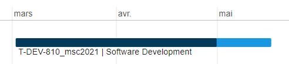
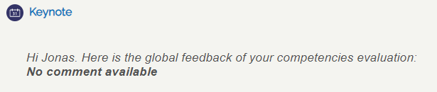

# Image Recognition - T-DEV-810

# Sommaire

- [Image Recognition - T-DEV-810](#image-recognition---t-dev-810)
- [Sommaire](#sommaire)
- [Presentation](#presentation)
- [Technologies](#technologies)
- [Environnement](#environnement)
  - [Dates](#dates)
  - [Temps à disposition](#temps-à-disposition)
  - [Projets en parallèle](#projets-en-parallèle)
- [Fonctionnalités](#fonctionnalités)
- [Equipe et répartition du travail](#equipe-et-répartition-du-travail)
  - [Membres de l'équipe](#membres-de-léquipe)
- [Notation](#notation)
- [Liens](#liens)

# Presentation

Intelligence Artificielle capable de détecter une pneumonie à partir d'une radio des poumons.

# Technologies
* Keras

# Environnement
Semestre 8 *(second semestre de M1)*

## Dates
* **Début :** 2020-03-02
* **Fin :** 2020-05-05

## Temps à disposition
**Nombre total de jours :** 19 (3,80 semaines; 0,95 mois)  
*Detail :*
* *Nombre de jours par semaine en cours : 2*
* *Nombre de semaines alternées : 10*
* *Nombre de semaines complètes en cours : 0*
* *Nombre de jours fériés : 1*

## Projets en parallèle 
* [T-ESP-800](https://github.com/HaberkornJonas/ManageMint_Frontend_T-ESP-900)
* [T-MAJ-800](https://github.com/HaberkornJonas/Voltron_Backend_T-MAJ-800)
* [T-WEB-800](https://github.com/HaberkornJonas/Epic-Road-Trip_Backend_T-WEB-800)

# Fonctionnalités
* Entrainement de l'intelligence artificielle sur un jeu de radio
* Estimation à partir d'une nouvelle radio

# Equipe et répartition du travail
**Nombre de commit total :** - *(Projet mené sur Kaggle, ce repository rassemble nos notebook jupyter)*  
**Chef de projet :** Adimi Redwane
**Documentation réalisée par :** Toute l'équipe  
**Diaporama de présentation réalisé par :** Toute l'équipe

## Membres de l'équipe
* **Adimi Redwane**
  * Etudiant à : Lille
  * Nombre de commits : -
  * Tâches implémentées : -
* **Haberkorn Jonas**
  * Etudiant à : Strasbourg
  * Nombre de commits : -
  * Tâches implémentées : -
* **Bouamama Matthieu**
  * Etudiant à : Lille
  * Nombre de commits : -
  * Tâches implémentées : -
* **Koacoz Ogün**
  * Etudiant à : Strasbourg
  * Nombre de commits : -
  * Tâches implémentées : -
* **Ibrahim Bila Maina Ari**
  * Etudiant à : Paris
  * Nombre de commits : -
  * Tâches implémentées : -

# Notation
**Référent pédagogique** : Moreel Nicolas (Toulouse)
  
**Proportion des compétences validé :** 79%    

**Retour pédagogique :**   

Feedback  

# Liens
* [Projet](https://github.com/HaberkornJonas/Image-Recognition_T-DEV-810/blob/post_delivery/project/IA.ipynb)
